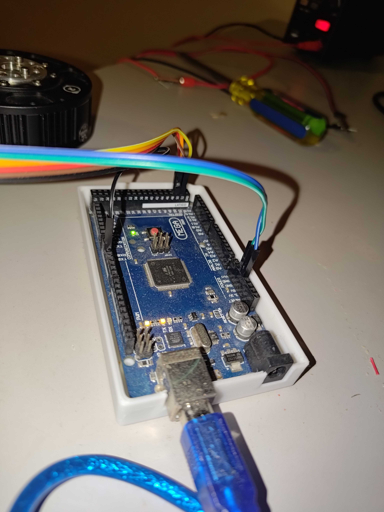
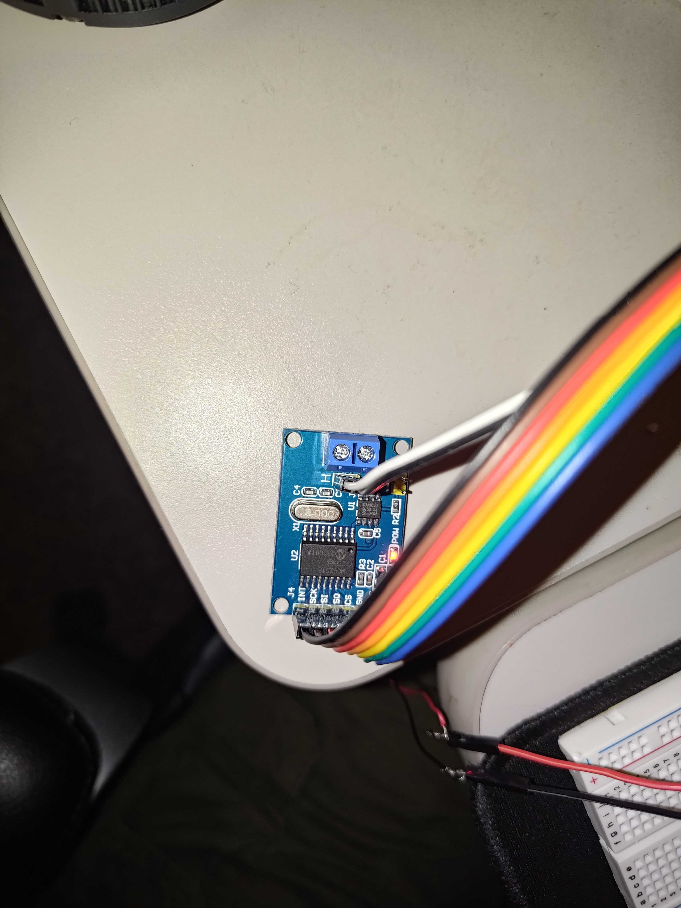
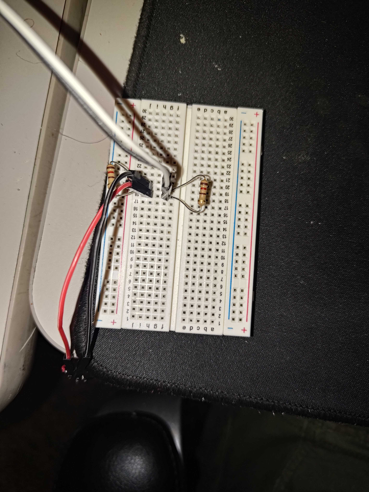

# gim-6010 canbus

Got this gim-6010 to work over can bus

## process

Mostly from [the spec sheet](SteadyWin%20GIM6010-8_English.pdf)

1. turn on can mode in odrive: https://docs.odriverobotics.com/v/latest/guides/can-guide.html#id6
2. connect a mcp-2515 to [the board](134aaa6bee2453ffde4397e595db3e4e612a1d9f.jpeg)

   | arduino     | mcp-2515 | 
   |-------------|----------|
   | any pwm pin | int      |
   | sck         | sck      |
   | mosi        | si       |
   | miso        | so       |
   | ss          | cs       |
   | gnd         | gnd      |
   | 5v          | vcc      |

3. connect the can highs together and the can lows together
4. terminate the can bus with a 120Ω resistor on each side
5. power the motor with dc. I found 24v worked. I set ocp to 4A just in case
5. load up [the sketch](sketch_may26a.ino). This was mostly stolen from [odrive](https://docs.odriverobotics.com/v/latest/guides/arduino-can-guide.html#example-sketch).
6. enter values in the serial monitor between -3 and 3 to see the motor spin 

## images

[1000003328.mp4](1000003328.mp4)

